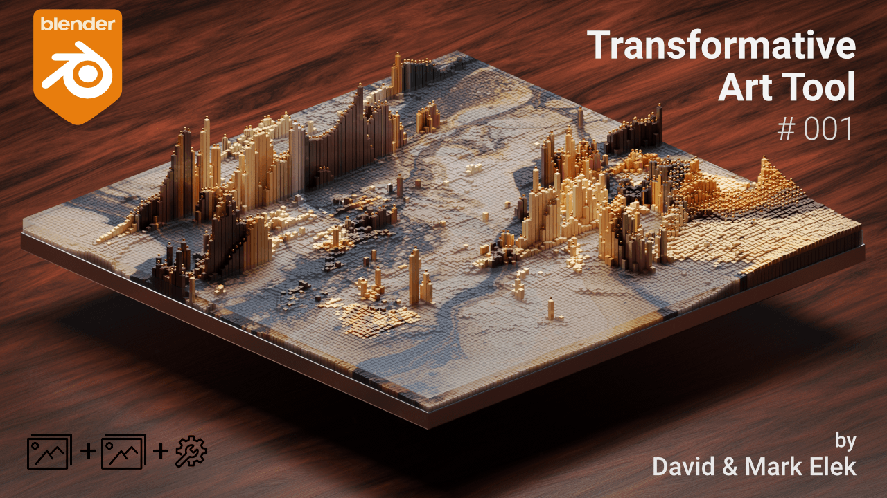

 
 

# 3D Pixels - Transformative Art Tool #001 
is a <a href="https://www.blender.org/" target="_blank">Blender</a> project using <a href="https://docs.blender.org/manual/en/latest/modeling/geometry_nodes/introduction.html" target="_blank">geometry nodes</a> that let's you create <a href="https://www.artstation.com/artwork/r98ExE" target="_blank">3D pixel/pin art</a> - like renders quickly by transforming 2 pictures into a totally new one with options to guide this process.

- ## 🛒 Available on - <a href="https://davidelek.gumroad.com/l/3dpixels">Gumroad</a>

- ## 🛒 Available on - <a href="https://blendermarket.com/products/3dpixels">Blender Market</a>

- ## 📄 Documentation - <a href="https://3d-pixels.readthedocs.io/en/latest/">Read the Docs</a> 
