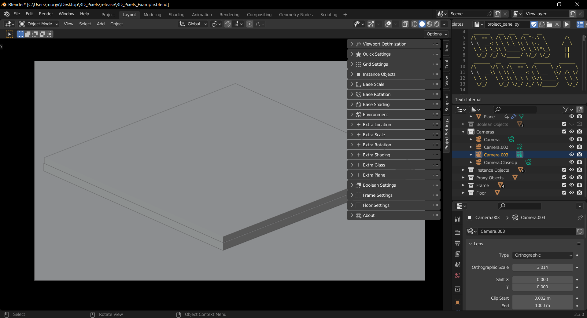

###########
Quickstart
###########

* Create a copy of the project file
* Open that file in |Blender|
* You should see something like this:

.. image:: images/window1.png
   :alt: Blender Window1

* Make sure the text editor is open
* Make sure the "project_panel.py" script is selected in the text editor (1.)
* Run the script (2.)

.. note:: Running the script is only needed if blender is closed.

* Press the 'n' key to open the editor's sidebar if it's not visible already.

* Switch to the "ProjectSettings" tab on the sidebar (3.)

* Make sure "Cycles" is the renderer
* Turn on shaded view
* Change the height and color textures in "Quick Settings"
* Change other settings to taste
* Render away

.. |Blender| raw:: html

   <a href="https://www.blender.org/" target="_blank">Blender</a>
