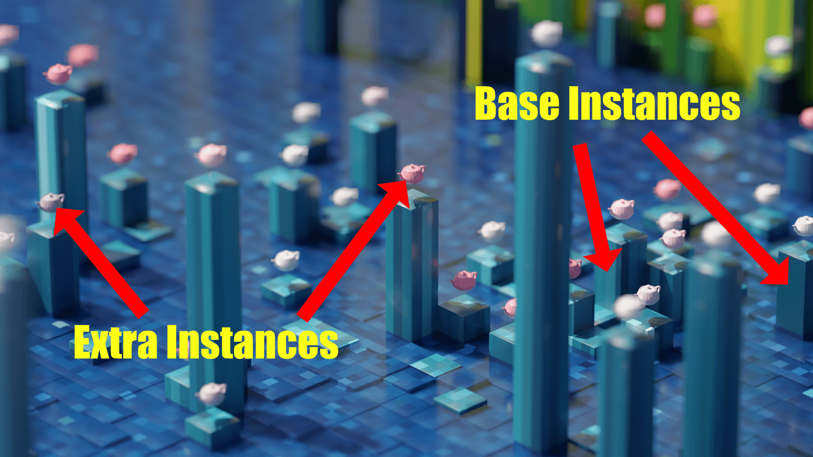
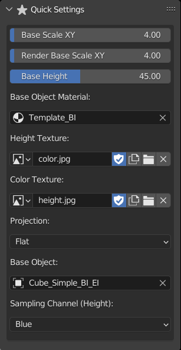
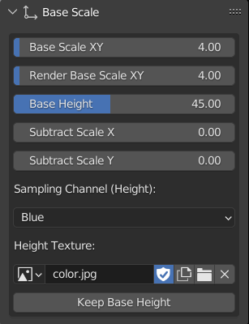
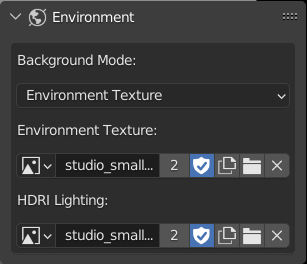
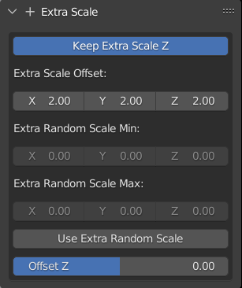
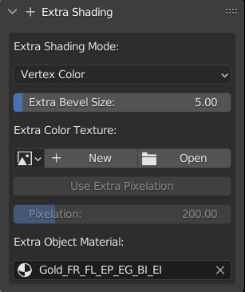
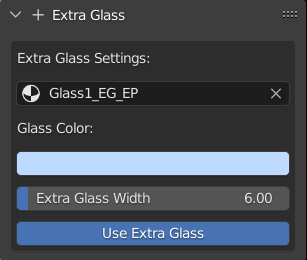
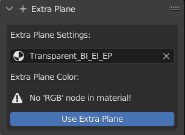
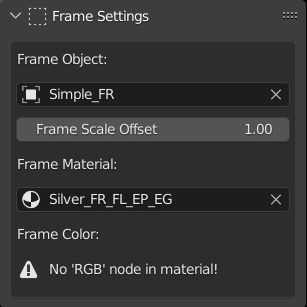

#########
Settings
#########

.. image:: images/panel_settings.png
    :alt: panel settings

.. note:: Some settings might not work with each other

.. note:: Type in the settings textboxes if the scene gets heavy

The Anatomy of the Scene
--------------------------

.. image:: images/anatomy1.png
    :alt: anatomy of the scene1

.. note:: The extra plane is between the "frame" and "extra glass"

.. note:: The extra plane can be seen if using a boolean object or sparse grid

Viewport Optimization
----------------------
Optimize things if the scene gets heavy.

.. image:: images/viewport_optimization.png
    :alt: viewport optimization settings

Quick Settings
------------------

Grid Settings
---------------
Modify the grid on which the objects are placed.

.. image:: images/grid_settings.png
    :alt: grid settings

Instance Objects
-----------------
Change the objects to use as base and extra instances

.. image:: images/instance_objects.png
    :alt: instance objects settings

.. note:: Extra objects are located on top of the base objects

Base Scale
-----------
Change the scale of base instances

Base Rotation
--------------
Change the rotation of base instances

.. image:: images/base_rotation.png
    :alt: base rotation settings

Base Shading
-------------
Shading settings for base instances

.. image:: images/base_shading.png
    :alt: base shading settings

Environment
------------
Environment Settings

.. note:: Option to use a different env. texture for lighting and background image

Extra Location
---------------
Offset the location of extra instances on the Z axis

.. image:: images/extra_location.png
    :alt: extra location settings

Extra Scale
--------------
Change the scale of extra instances

Extra Rotation
---------------
Change the rotation of extra instances by setting an object to "look at"

.. image:: images/extra_rotation.png
    :alt: extra rotation settings

Extra Shading
--------------
Shading settings for extra instances

Extra Glass
--------------
Settings for the glass layer

Extra Plane
--------------
Settings for the extra plane layer

Boolean Settings
-----------------
Use a mesh to cut into the whole scene

.. image:: images/boolean_settings.png
    :alt: boolean settings

Frame Settings
-----------------------
Settings for the frame

Floor Settings
------------------------
Settings for the floor

.. image:: images/floor_settings.png
    :alt: floor settings

